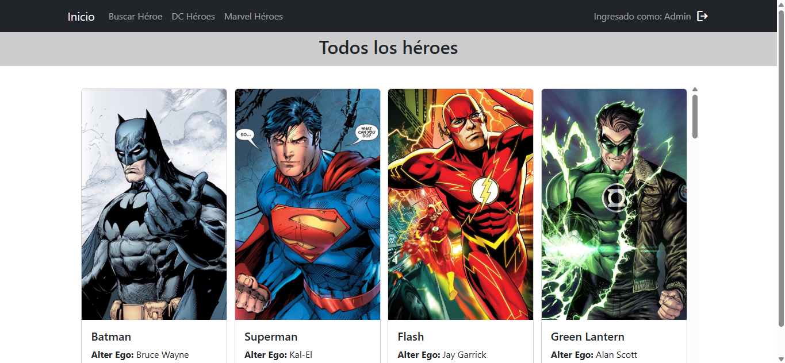
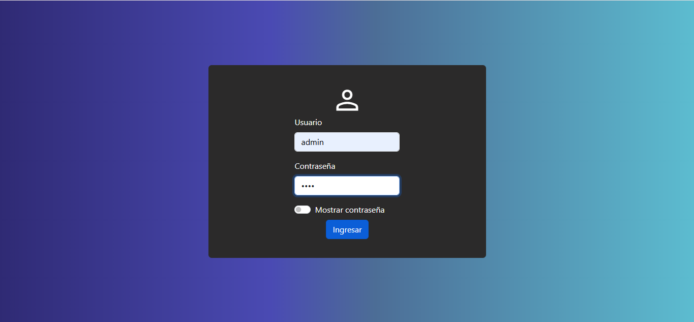
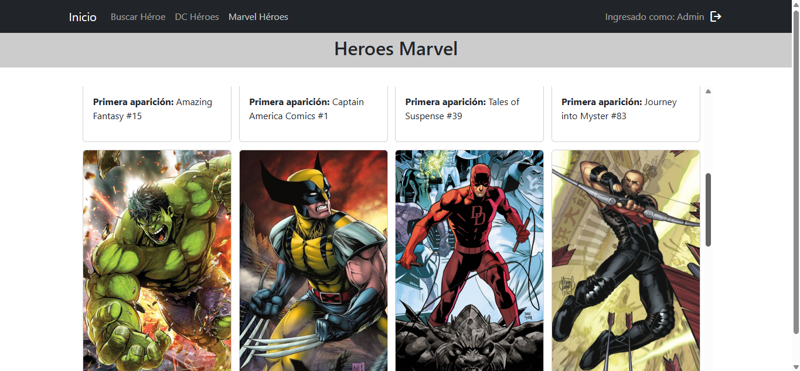
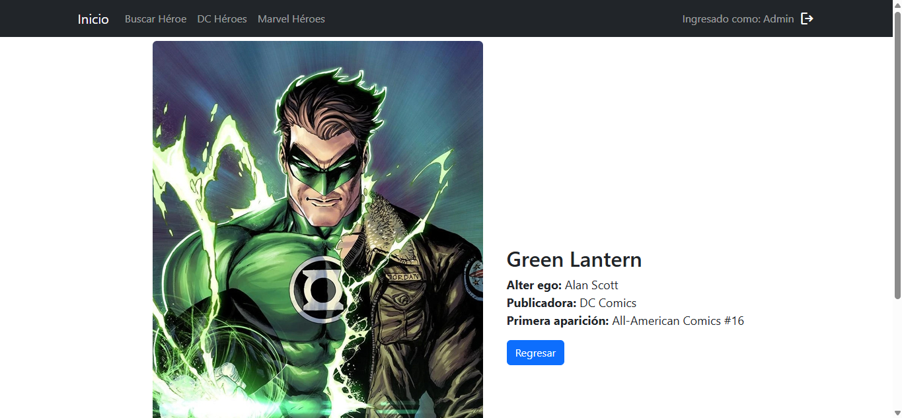
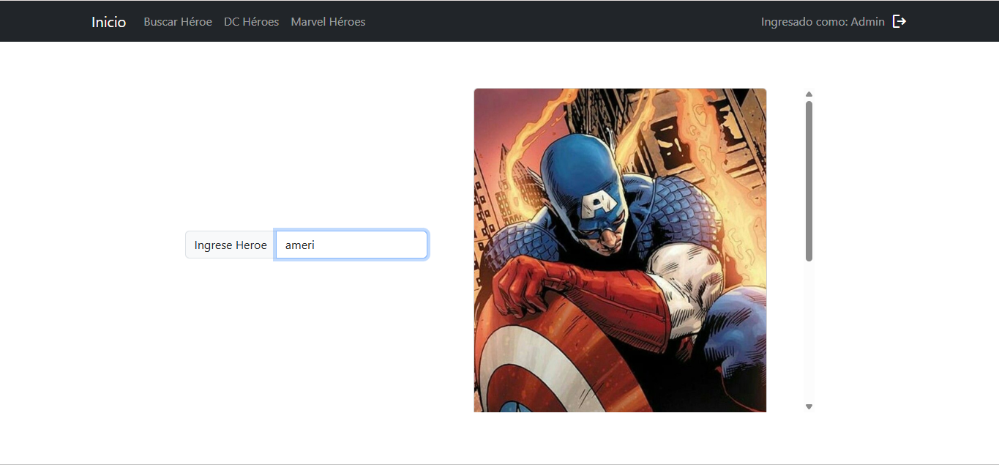

# Heroes App
 Esta aplicación permite al usuario explorar una galería de héroes de distintos cómics y series y obtener información específica de cada uno.
 
 Proyecto individual realizado como trabajo práctico para la carrera Tecnicatura Universitaria en Programación - UTN Mza.
 

## Características
- **Galería de Héroes:** Visualiza una lista de héroes con imágenes y descripción.
- **Filtrado:** Filtra los héroes por Marvel o DC para ver solo los que te interesan.
- **Buscar:** Barra de búsqueda para encontrar uno o más heroes cuyo nombre coincida con el texto ingresado.
- **Vista del héroe:** Haz clic en una tarjeta de héroe para tener una vista más amplia del mismo.
 
## Tecnologías Utilizadas
 - React + TypeScript
 - CSS
 - Vite
 - Redux como manejador de estado

## Cómo ejecutar

* Instalar dependencias: **npm install**

* Ejecutar: **npm run dev**

## Instrucciones de uso
Esta es una aplicación de demostración para fines académicos. Para acceder:

**Credenciales de prueba:**
* Usuario: `admin`
* Contraseña: `1234`

## Preview

   **Pantalla Login**
   

   **Sección Marvel**
   
   
   **Vista de Héroe**
   

   **Pantalla de Búsqueda**
   
